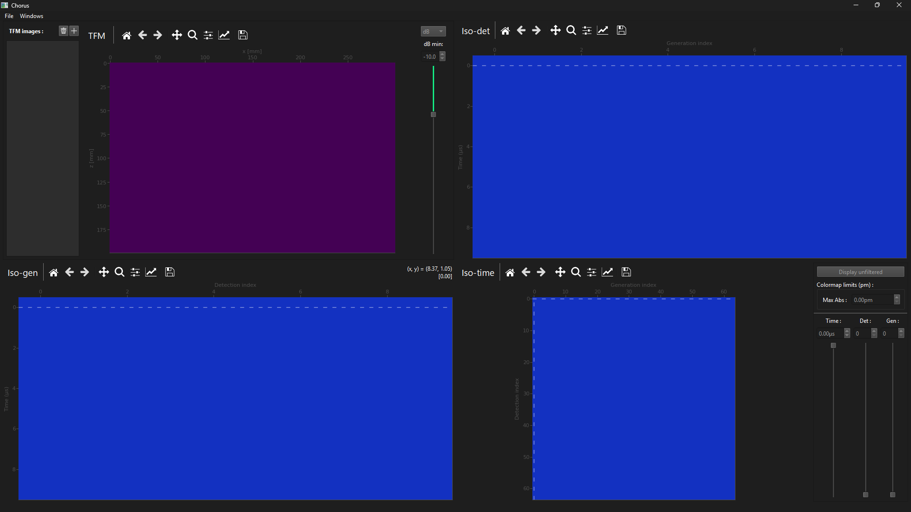

# Chorus

Chorus is an application for the interactive visualisation of full matrix capture (FMC)
data sets, total focussing method (TFM) images and relationships between the two.

Developed by Matthew Riding at the University of Strathclyde 2021-2025.

## What can Chorus do?

- Interactive slicing of the 3D full matrix data volume to plot colour maps of displacement in 
the iso-time, iso-generation and iso-detection planes.
- Computation of delay-and-sum TFM images.
- Interactive plotting of the delays used in the delay-and-sum operation inside the (g,d,t) data
volume for a chosen pixel (x,z) in a TFM image.
- Interactive plotting of the set of pixels a single data point at (g,d,t) contributes to along
an isochron in the XZ imaging plane.
- Interactive extraction and plotting of pixel contribution matrices: the set of displacements
extracted at the delay times for a given pixel, which are summed to give the total delay-and-sum
displacement for that pixel.

## Installation
Options:
1. Fork on GitHub (recommended) and open your fork in a GitHub-connected IDE such as PyCharm.
2. Download a local copy of the master branch from GitHub as a .zip.

Make sure you have all Python packages listed in `requirements.txt` installed in your virtual
environment.

## Usage
To open the full Chorus GUI, run `main.py`.

The Chorus `MainWindow` should appear as in the screenshot below:

## Compatible full matrix displacement data file formats

See the relevant pages of the Chorus wiki:
- [Array requirements](https://github.com/MatthewRiding/Chorus/wiki/Data-format-requirements:-Array-requirements)
- [File format requirements](https://github.com/MatthewRiding/Chorus/wiki/Data-format-requirements:-File-formats)
